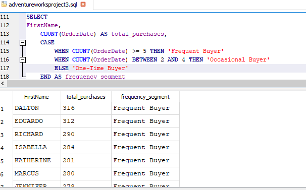
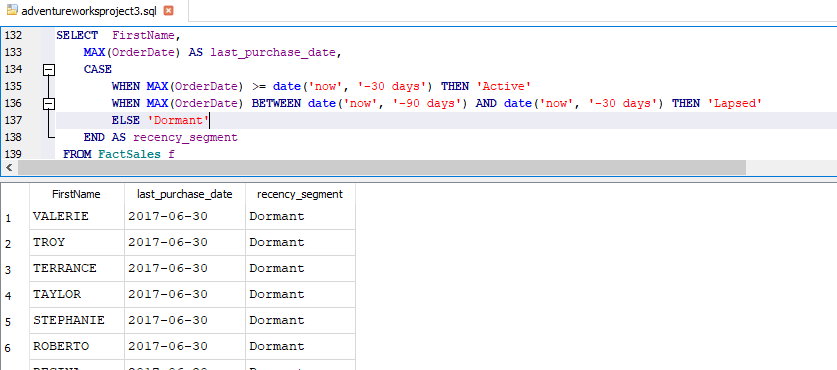

# Adventureworks_project3

- perform time series analysis by analysing sales data by year and month to understand the seasonality and variation
  
   sales by Month and Year

  
  
   Sales Variation

   

   sales variation across months:

   

- identify trends and patterns to discover the top performing  product, and region based on sales in 2015,july 2016 and september 2017

 

 - Analze customer demographics and purchasing patterns to understand customer behaviour
   

   Total Purchases by Gender

   
   

    Average Purchase Amount by Age Group

    

-  perform customer segmentation based on purchasing or spending using sql

  
  Segment Customers by Total Spending

  
  In this query:

 Customers who have spent over $1000 are classified as High Spenders.
 Those who have spent between $500 and $1000 are classified as Medium Spenders.
 Those with spending below $500 are classified as Low Spenders.

 Segment Customers by Purchase Frequency
  

   

  In this query:

 Customers who made 5 or more purchases are classified as Frequent Buyers.
 Those with 2-4 purchases are Occasional Buyers.
 Those with 1 purchase are One-Time Buyers.
 

 Segment Customers by Recency (RFM Analysis)

  

  In this query:

 Active customers made purchases within the last 30 days.
 Lapsed customers made their last purchase between 30-90 days ago.
 Dormant customers made their last purchase more than 90 days ago.

-  perform customer segmentation based on purchasing or spending using sql

  
  Segment Customers by Total Spending

  
