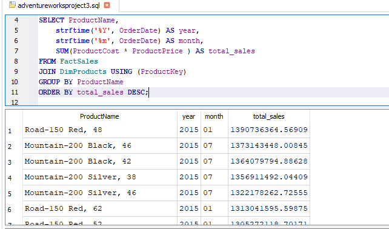
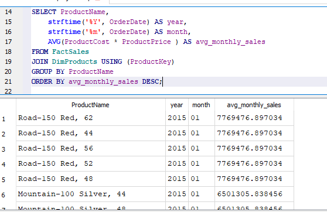
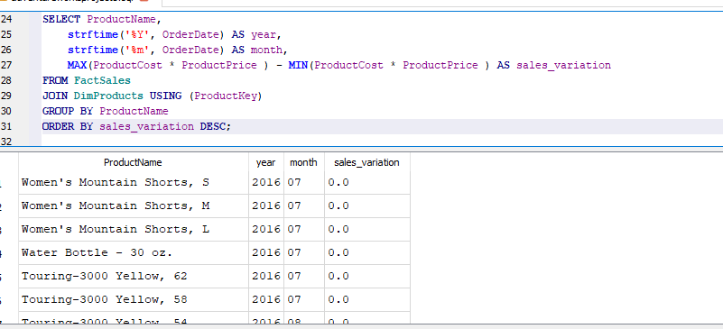
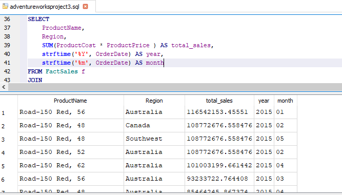
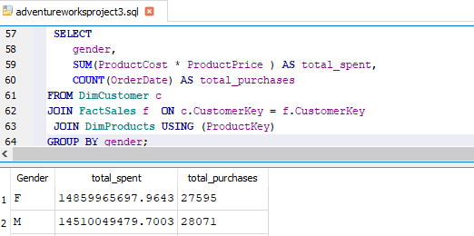

# Adventureworks_project3

- perform time series analysis by analysing sales data by year and month to understand the seasonality and variation
  
   sales by Month and Year

  
  
   Sales Variation

   

   sales variation across months:

   

- identify trends and patterns to discover the top performing  product, and region based on sales in 2015,july 2016 and september 2017

 

 - Analze customer demographics and purchasing patterns to understand customer behaviour
   

   Total Purchases by Gender

   
   

    Average Purchase Amount by Age Group

    

-  perform customer segmentation based on purchasing or spending using sql

  
  Segment Customers by Total Spending
